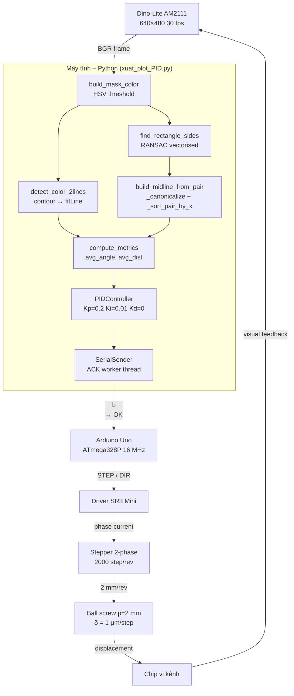
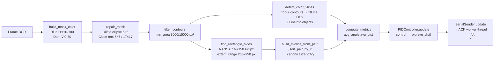

# Micro-Positioning System for Microfluidic Chip Assembly

<div align="center">


**Hệ vi dịch chuyển tự động ứng dụng thị giác máy tính trong lắp ráp chip vi kênh**

*Vision-based closed-loop micro-positioning system for microfluidic chip alignment*

</div>

---

## Tổng quan

Hệ thống điều khiển vòng kín tự động căn chỉnh chip vi kênh lên lớp nền vi điện cực.  
Camera nhận frame thời gian thực → pipeline xử lý ảnh tính sai lệch hình học → PID → Serial ACK → Arduino → động cơ bước.

---

## Tính năng

- **HSV masking 3D** — tách đường tham chiếu xanh (H:110–180) và vùng tối vi điện cực (V:0–70)
- **Contour-based line clustering** — thay thế DBSCAN/KMeans bằng `cv2.findContours` C++ (~40–80× nhanh hơn)
- **RANSAC vectorised** — khoảng cách tính bằng cross-product 2D thay SVD per-iteration (~10–15× nhanh hơn)
- **Virtual centre line stable (v4)** — `_canonicalize` + `_sort_pair_by_x` loại bỏ hoàn toàn hiện tượng "flipping" frame-to-frame
- **PID rời rạc** — wall-clock dt, anti-windup integral clamp, output clamp
- **Serial ACK** — giao thức stop-and-wait `<N>b\n` → `OK\n` với timeout 10 s

---

## Video Demo

Xem video demo hệ thống hoạt động thực tế:

**[https://www.youtube.com/watch?v=your-video-id](https://www.youtube.com/watch?v=your-video-id)**

*(Thay đường link trên bằng link video YouTube thực tế của bạn)*

---

## Kiến trúc hệ thống



---

## Pipeline xử lý ảnh



---

## Cấu trúc repository

```
micro-positioning-system/
│
├── README.md
├── LICENSE
├── .gitignore
├── requirements.txt
│
├── src/
│   └── xuat_plot_PID.py            ← Toàn bộ pipeline Python (1 138 dòng)
│
├── arduino/
│   └── stepper_controller/
│       └── Arduino_test_X_ack.ino  ← Firmware ATmega328P (ISR + ACK)
│
├── tests/
│   ├── test_pid.py                 ← Unit tests PIDController
│   ├── test_metrics.py             ← Unit tests signed_angle/distance/compute_metrics
│   └── test_vision.py              ← Unit tests mask/RANSAC/midline/canonicalize
│
├── scripts/
│   ├── calibrate_camera.py         ← Đo SCALE_UM_PER_PX bằng click
│   ├── test_serial.py              ← Test ACK protocol không cần camera
│   └── plot_results.py             ← Vẽ PID response từ CSV
│
├── docs/
│   ├── architecture.md
│   ├── methodology.md
│   ├── experiments.md
│   └── api.md
│
└── results/
    └── pid_response_sample.csv
```

---

## Cài đặt

```bash
git clone https://github.com/<your-username>/micro-positioning-system.git
cd micro-positioning-system

python -m venv venv
source venv/bin/activate        # Linux/Mac
# venv\Scripts\activate         # Windows

pip install -r requirements.txt
```

Nạp firmware Arduino:
1. Mở `arduino/stepper_controller/Arduino_test_X_ack.ino` trong Arduino IDE
2. Chọn board **Arduino Uno** và đúng cổng COM
3. Upload

---

## Cấu hình chính (`src/xuat_plot_PID.py`)

```python
SCALE_UM_PER_PX: float = 10_000 / 300   # ≈ 33.33 µm/px — hiệu chuẩn lại nếu cần

SERIAL_PORT     = "COM5"         # Linux: "/dev/ttyACM0"
SERIAL_BAUDRATE = 115_200
SERIAL_ENABLE   = True           # False → dry-run không cần phần cứng
ACK_TIMEOUT_S   = 10.0

# PID (trong main())
PIDController(kp=0.2, ki=0.01, kd=0.0,
              integral_limit=5_000.0, output_limit=150_000.0)
```

---

## Sử dụng

```bash
# Chạy hệ thống
python src/xuat_plot_PID.py

# Hiệu chuẩn camera
python scripts/calibrate_camera.py --length 10000 --camera 1

# Test Serial + Arduino
python scripts/test_serial.py --port COM5 --steps 500

# Vẽ đồ thị từ CSV
python scripts/plot_results.py --csv results/pid_response_sample.csv

# Chạy unit tests
python -m pytest tests/ -v
```

Phím tắt trong cửa sổ OpenCV: `q` để thoát.

---

## Phần cứng

| Linh kiện | Thông số |
|---|---|
| Camera | Dino-Lite AM2111, 640×480, 30 fps |
| Vi điều khiển | Arduino Uno (ATmega328P, 16 MHz) |
| Driver | SR3 Mini, STEP/DIR, vi bước |
| Động cơ | Stepper 2 pha, 2000 vi-bước/vòng |
| Vít me | p = 2 mm/vòng, δ = 1 µm/vi-bước |

---

## Kết quả thực nghiệm

| Thông số | Giá trị | Đơn vị |
|---|---|---|
| Hệ số tỷ lệ S | 33.33 | µm/px |
| Sai lệch ban đầu | +1 731.6 | µm |
| Thời gian xác lập t_s | ≈ 2.5 | s |
| Sai số hội tụ | < 33 | µm |
| Quá điều chỉnh | ≈ 15% | — |
| Sai lệch tĩnh | 0 | — |

---

## Điểm kỹ thuật nổi bật (v4 fix)

### Loại bỏ "flipping" đường trung tâm ảo

RANSAC/SVD trả về vectơ đơn vị vô hướng: cả `+d` và `−d` đều hợp lệ.  
Phiên bản cũ chỉ dùng dot-product để align `d2` theo `d1`, nhưng nếu `d1` tự lật giữa các frame thì kết quả vẫn lật.

Giải pháp v4 (`build_midline_from_pair`):
1. `_canonicalize(d1)` — áp dụng quy tắc hướng tuyệt đối cho `d1` trước
2. `if dot(d1_canonical, d2) < 0: d2 = -d2` — align `d2` theo `d1` đã chuẩn
3. `_canonicalize(avg)` — chuẩn hóa kết quả cuối cùng

`_sort_pair_by_x` — sắp xếp `pair[0]/pair[1]` theo centroid X mỗi frame, gán nhất quán left/right.

---

## Trích dẫn

```bibtex
@misc{nguyen2026micropos,
  author      = {Nguyễn Hoàng Đức},
  title       = {Nghiên cứu và phát triển hệ vi dịch chuyển ứng dụng trong lắp ráp chip vi kênh},
  year        = {2026},
  institution = {Trường Đại học Khoa học Tự nhiên, ĐHQGHN},
  note        = {Tiểu luận, Ngành Kỹ thuật điện tử và tin học},
  supervisor  = {ThS. Nguyễn Cảnh Việt}
}
```

---

## Tác giả

| Họ tên | MSSV | Vai trò |
|---|---|---|
| Nguyễn Hoàng Đức | 23001599 | Tác giả |
| ThS. Nguyễn Cảnh Việt | — | Giảng viên hướng dẫn |

Đơn vị: Khoa Vật Lý, Trường Đại học Khoa học Tự nhiên, ĐHQGHN

---

## Giấy phép

[MIT](LICENSE)
